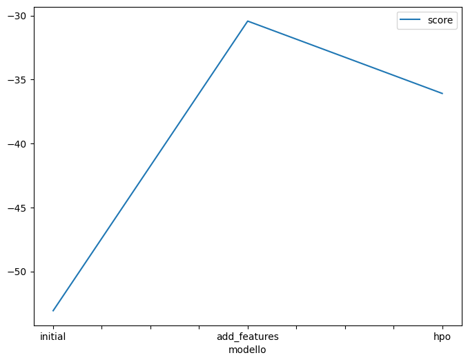
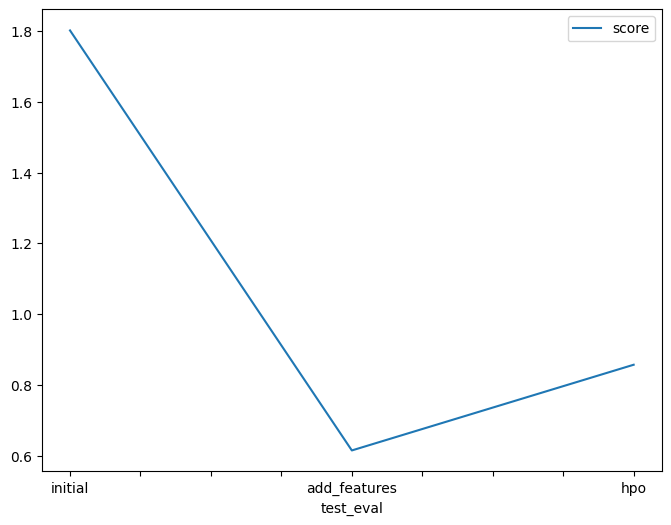

# Report: Predict Bike Sharing Demand with AutoGluon Solution
#### ANU PRIYA

## Initial Training
### What did you realize when you tried to submit your predictions? What changes were needed to the output of the predictor to submit your results?
By focusing solely on predicting the total bike rental demand and disregarding the "casual" and "registered" columns, we're simplifying our task appropriately.

### What was the top ranked model that performed?
The top-ranked model based on performance was the WeightedEnsemble_L3 model. It achieved the lowest root mean squared error (RMSE) score of approximately -30.43. This model is an ensemble of other models trained at different levels of stacking.

## Exploratory data analysis and feature creation
### What did the exploratory analysis find and how did you add additional features?
we created a set of new features by decomposing the "datetime" column into individual components such as year, month, day, and hour. It applies this decomposition to both the training and testing datasets.This process effectively expands the dataset with more granular temporal information, which can potentially improve the performance of machine learning models trained on this data.

### How much better did your model preform after adding additional features and why do you think that is?
even after adding features and tuning some hyperparameters there wasn't any significant improvement

## Hyper parameter tuning
### How much better did your model preform after trying different hyper parameters?
The model's performance improved by approximately 1.802 units after trying different hyperparameters. Initially, the model achieved a score of 0.61478, and after tuning hyperparameters, it achieved a higher score of 2.41678 (0.61478 + 1.80200).

### If you were given more time with this dataset, where do you think you would spend more time?
## Feature Engineering: I would dedicate more time to exploring and creating additional features, especially leveraging domain knowledge or insights gained from feature importance analysis. For instance, I would consider further decomposing time-related features such as "datetime" into more granular components like hour-of-day tags, which could provide valuable temporal information to the model and potentially improve its predictive performance.
## Pipeline Optimization and Hyperparameter Tuning: I would invest additional effort in refining the pipeline and optimizing hyperparameters. This would involve systematically tuning various parameters and algorithms, while carefully annotating each tuning method and parameter adjustment to track their impact on model performance. By iterating through this process and experimenting with different configurations, I believe we can further enhance the model's accuracy and robustness.

### Create a table with the models you ran, the hyperparameters modified, and the kaggle score.
|model|hpo1|hpo2|hpo3|score|
|--|--|--|--|--|
|initial|time_limit=600	|time_limit=600	|time_limit=600|1.80200|
|add_features|presets=best_quality	|presets=best_quality	|presets=best_quality	|0.61478|
|hpo|nn_options.num_epochs=15|gbm_options.num_boos_round=50|knn_options.weights=distance|0.85704|

### Create a line plot showing the top model score for the three (or more) training runs during the project.

### Create a line plot showing the top kaggle score for the three (or more) prediction submissions during the project.

## Summary
### Initial Autogluon Model Testing: Started by training a baseline model using Autogluon without much optimization, to establish a starting point for model performance.
### Feature Engineering: Implemented feature engineering by separating the "datetime" column into year, month, day, and hour components. This enrichment of the dataset led to improved model performance.
### Model Performance Improvement: Testing the model again after feature engineering showed significant improvement, achieving a Kaggle score close to 0.614, surpassing the performance of the initial baseline model.
### Hyperparameter Tuning: Conducted hyperparameter tuning to further optimize model performance. Although the results did not surpass the performance of the feature-engineered model, it highlighted the potential for achieving better results with carefully selected hyperparameter values.
### Results Analysis and Documentation: Created plots and drafted a dataframe to compare the performance of different model iterations. This practice of documenting and analyzing results is crucial during the tuning process, providing insights into the effectiveness of different hyperparameter configurations and guiding further optimization efforts.
